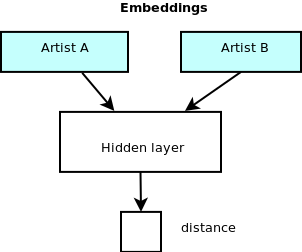

In this post I want to solve the problem of music recommendation. This is
a problem where it is easy to see how collecting user data can be useful.

For example you might calculate the probability of an individual user enjoying
an artist given their listening history and the history of other similar users.

Since I am not Spotify, Google, or Apple (and I don't want to be), I cannot
use data about users to solve this problem.

[Source code](https://github.com/crestonbunch/wiki-data)

# TL;DR

Building an all-pairs shortest path matrix between pages on Wikipedia turns
out to be a reasonable model for musical similarity with some non-traditional
dimensionality reduction.

Scroll to the end for some results.

# Defining the problem

For the purposes of this post, I will define the problem as the following
question:

> Given a musician or band A, who are some other similar artists?

By the end of this post I will have explained one way to build a model
that can answer this question without harvesting data from people. 

# The quest begins

To start solving this problem I need two things: 

1. a list of musical artists.
2. some notion of similarity between artists

Okay, solving number one seems easy right? Let's skip that part.

## Similarity of artists

There are a lot of places to get information on musicians. For this project I
focused on two sources in particular:

1. [English Wikipedia](https://en.wikipedia.org/wiki/Main_Page)
2. [MusicBrainz](https://musicbrainz.org/)

Both of these sources of data offer free use of their data. Wikipedia uses a
Creative Commons license and MusicBrainz releases their data in the public
domain.

After digging through MusicBrainz for a while, I couldn't find much data that
relates two artists (especially reliable data, a lot of it is incomplete or
missing.) They do have [ratings](https://musicbrainz.org/artist/164f0d73-1234-4e2c-8743-d77bf2191051/ratings)
for artists which could be useful, but many artists have no ratings or very
few ratings so using this as a data source would be noisy and unreliable.

Wikipedia is much easier. Every page links to other pages so we can easily build
a graph of links between artists on Wikipedia. The distance between two artists
might say something about how similar they are. So let's do that.

Okay we solved the hard problem. Let's solve the easy problem now.

## Getting a list of artists

Now that we know we want to model a graph of Wikipedia pages, we need to gather
a list of Wikipedia pages that correspond to musical artists. These don't
correspond to the band names because the Wikipedia page for 'Scorpions' is about
the anthropod. For the band 'Scoprions' you have to look up 'Scorpions (band)'.

Easy. Let's use the links on MusicBrainz.

Let's just spin up a [MusicBrainz docker image](https://hub.docker.com/r/linuxserver/musicbrainz/) 
and pull a list of artists and their Wikipedia pages from the Postgres database.

The query to get the URL for Scorpions looks like:

select artist."name", url.url
from artist, url, l_artist_url
where artist.id = l_artist_url.entity0
and url.id = l_artist_url.entity1
and url.url like '%en.wikipedia%'
and artist."name" = 'Scorpions';


Aaannd we get:

    Scorpions	https://en.wikipedia.org/wiki/Scorpions_(band)

Let's try one more band to be sure:

select artist."name", url.url
from artist, url, l_artist_url
where artist.id = l_artist_url.entity0
and url.id = l_artist_url.entity1
and url.url like '%en.wikipedia%'
and artist."name" = 'Metallica';


Nothing. There's no Wikipedia link in the MusicBrainz database for Metallica.

Then _what_ is this:

...apparently these Wikipedia samples are generated on the fly
by appeding [`/wikipedia-extract` to the page URL](https://musicbrainz.org/artist/65f4f0c5-ef9e-490c-aee3-909e7ae6b2ab/wikipedia-extract)

Alright fine. I can't use MusicBrainz to get the data I need. Let's see what
I can scrape from Wikipedia.

Possible options:

1. ~~Occupation from the info box on the right.~~ Too many possibilities.
2. ~~Some kind of search for keywords.~~ Too unpredictable or unreliable.
3. ~~Categories the page belongs to.~~ Way too many possibilities.
4. Hold on...what's this

### Revelation: _Wikipedia has MusicBrainz links on artist pages_

A few clicks later and the [problem is solved](https://en.wikipedia.org/wiki/Category:Wikipedia_articles_with_MusicBrainz_identifiers)

Once I use the [Categorymembers](https://www.mediawiki.org/wiki/API:Categorymembers) API
I end up with a 98470 line `artists.txt` file.

# Building the graph

So my first instinct, and maybe yours too, is to go to the 
[Wikipedia data dumps](https://dumps.wikimedia.org/enwiki/latest/) and download
`pagelinks.sql.gz` and import it into a MySQL database.

I don't recommend doing this because the import will take days. I spent way too
long trying to figure out how to make MySQL imports faster, but in the end
I abandoned that approach.

[mirkonasato on GitHub had a much better idea](https://github.com/mirkonasato/graphipedia)
and I just used his code to build an entire graph of Wikipedia pages in a
neo4j database. It only took a few hours.

A short script later and all the Wikipedia pages with MusicBrainz pages were
tagged with `{artist: true}`.

Neo4j is pretty cool. I had never used it before.

# Building the matrix

Remember when I said I would use the distance between two Wikipedia pages as
a measure of the artist similarity? Well now I have to build that matrix.
To be extra clear: the distance will count edges of the graph that connect 
_other_ artists' pages. So no edge will be counted unless the connected vertex
also had a link to MusicBrainz on the Wikipedia page.

In total I will have almost 100,000 artists accounted for. This means the
all-pairs shortest path matrix will be 100,000 by 100,000. It's pretty hard to
fathom how big this is so let me try to explain it in different ways:

1. There are almost 1 _billion_ entries of the matrix.
2. The iPhone X has a 12 megapixel camera. Images taken by iPhone X are
   83 times smaller than this matrix.
3. Stored as 32 bit integers this matrix is 37GiB.
4. Computing the all-pairs shortest path problem using the canonical
   Floyd-Warshall algorithm in O(V3) would take 
   1,000,000,000,000,000 operations.

Dealing with matrices this big means almost everything I do has to be GPU
accelerated or it will simply take too long.

So let's figure out what libraries I can use to GPU accelerate the all-pairs
shortest path problem.

1. [nvGraph](https://docs.nvidia.com/cuda/nvgraph/index.html) by Nvidia which 
   doesn't appear to (yet) have Python bindings and seems sparsley documented
   with no examples.
2. [gunrock](https://github.com/gunrock/gunrock) which shows how you can use
   the Python ctypes library but doesn't (yet) have Python bindings. And also
   has Python sample code for single-source shortest path which I can extend
   to all pairs shortest path.

Okay, I guess the choice is clear.

I setup gunrock in a Docker container, and run a script to start finding
shortest paths.

    Some CUDA error about being out of memory.

I guess gunrock has a memory leak because it can't be _my_ fault. The code I
wrote should have a constant memory requirement. So I setup
the script to stop and restart occasionally to clear out memory and let it 
run overnight. I also spend an obscene amount of time trying to optimize the 
Python code to save as quickly as possible.
# Dimensionality reduction

At this point I am the proud owner of approximately 1 billion shortest path
distances. The matrix can be thought of as _samples_ which have _features_.
Each row of the matrix is a sample (an artist) each of which has 100,000 
features (distances to other artists). In any kind of machine learning 
application 100,000 features would probably be too many so we need to come up
with a way to reduce the dimensions to something managable.

Scikit learn [has a bunch of algorithms for this](http://scikit-learn.org/stable/modules/decomposition.html#decompositions).

Unfortunately I can't use any of them because they're not GPU accelerated and
I don't think any of them would finish in a reasonable amount of time.

However there is [scikit-cuda](https://github.com/lebedov/scikit-cuda) which
is a GPU accelerated subset of scikit-learn with a similar API. They have a
PCA algorithm!

...except their PCA algorithm is insufficient. Remember my matrix is 37GiB?
Yeah I only have 22GB of GPU memory and their algorithm _copies_ the matrix
among other stuff it needs memory for.

# Getting creative

I spent a while looking for iterative solutions for PCA and such. But the
research papers are dense and my knowledge of GPU programming is limited, so
I opted to get more creative with my solution to dimensionality reduction.

There are two options I experimented with:

1. [Embeddings](https://www.tensorflow.org/guide/embedding) which I randomly
   initialize for each artist, then update via backpropagation in order
   to predict their distance in the all-pairs shortest path matrix.
   

2. Compression whereby I train a neural network to learn the identify function 
   by 'compressing' the vector into a lower-dimensional space and then
   decompressing it back into its original space. Then I run only the 'compress'
   step over every vector and store the results.

   

The first option I attempted but could not complete after I calculated it would
take 10 days to complete one epoch. Each epoch has 1,000,000,000 samples to
iterate over since it operates cell-by-cell.

In contrast the second option takes very little time to complete 10 epochs
since each epoch only has 100,000 samples to iterate over.

To identify similar artists we can use the cosine distance between two vectors
and simply return the ones with the smallest distance.

# Results

It turns out the 'compression' method of dimensionality reduction works 
remarkably well.

Here are the top-10 most similar artists for a few inputs:

## Scorpions (band)

    1.615E-11 Christofer Johnsson
    1.885E-11 Persian Risk
    1.898E-11 Voivod (band)
    1.915E-11 Geoff Downes
    1.965E-11 The Rasmus
    1.988E-11 Vinnie Vincent
    1.993E-11 Goudie (band)
    2.027E-11 Eddie Trunk
    2.031E-11 Sword (band)
    2.031E-11 Kip Winger

## M83 (band)

    1.740E-11 Josh Wink
    1.784E-11 Dead Letter Circus
    1.814E-11 Crystal Castles
    1.854E-11 Iamamiwhoami
    1.858E-11 Envy on the Coast
    1.889E-11 Vaccine (musician)
    1.893E-11 Polly Scattergood
    1.917E-11 Editors (band)
    1.948E-11 Skrillex
    1.979E-11 The Faint

## Michael Jackson

    2.277E-11 Matt Giraud
    2.331E-11 Mary J. Blige
    2.412E-11 Liza Minnelli
    2.412E-11 Siobhan Magnus
    2.472E-11 Bruce Gowers
    2.490E-11 Brandy Norwood
    2.493E-11 Nicole Scherzinger
    2.500E-11 Sanjaya Malakar
    2.506E-11 Stock Aitken Waterman
    2.523E-11 James Arthur

## Katy Perry

    2.680E-11 Eminem
    2.711E-11 Pink (singer)
    2.786E-11 Dave Audé
    2.870E-11 Timbaland
    2.911E-11 Madonna (entertainer)
    2.948E-11 Junior Vasquez
    3.051E-11 Kurt Hugo Schneider
    3.072E-11 Ellie Goulding
    3.148E-11 Lady Gaga
    3.163E-11 Lorde

## Eminem

    2.052E-11 T.I.
    2.067E-11 George Clinton (musician)
    2.069E-11 Nicki Minaj
    2.134E-11 Sanjaya Malakar
    2.140E-11 Annie Leibovitz
    2.151E-11 Miley Cyrus
    2.170E-11 Dave Audé
    2.173E-11 Cat Power
    2.176E-11 Adam Schlesinger
    2.184E-11 Raphael Saadiq

## Kraftwerk

    2.352E-11 Can (band)
    2.756E-11 Radiohead
    2.919E-11 Ben Perowsky
    2.960E-11 Karlheinz Stockhausen
    3.074E-11 Jack White
    3.168E-11 Gustavo Cerati
    3.223E-11 Anthony Marinelli
    3.226E-11 KMFDM
    3.238E-11 St. Vincent (musician)
    3.245E-11 Joseph Arthur

## Mannheim Steamroller

    1.152E-11 Horrie Dargie
    1.223E-11 Stephanie McIntosh
    1.248E-11 Moony
    1.296E-11 Steve Whitmire
    1.392E-11 Barry Crocker
    1.432E-11 Dominic Frontiere
    1.447E-11 Amy Sky
    1.529E-11 Raybon Brothers
    1.553E-11 Danny Williams (singer)
    1.555E-11 Graeme Connors

## Metallica

    2.533E-11 Audiovent
    2.631E-11 Byron Stroud
    2.746E-11 Jerry Cantrell
    2.790E-11 Layne Staley
    2.831E-11 Michael Schenker
    2.838E-11 The Offspring
    2.869E-11 Tony Iommi
    2.873E-11 Matt Sorum
    2.876E-11 James Hetfield
    2.929E-11 Brian Robertson (guitarist)

## Avicii

    1.853E-11 Sick Individuals
    1.956E-11 Jodie Harsh
    1.958E-11 Syn Cole
    2.022E-11 The Black Eyed Peas
    2.104E-11 Birdy (singer)
    2.114E-11 Bryan Ferry
    2.127E-11 Hudson Mohawke
    2.166E-11 4 Non Blondes
    2.167E-11 Mika (singer)
    2.167E-11 Deadmau5

# Evaluating

Clearly the model is not perfect. I'm not sure what the intersection of
Eminem fans and Miley Cyrus fans are, but it's probably not the kind of
recommendation you expect to find.

On the other hand, the results for Katy Perry would probably look good to me
if I were a Katy Perry fan (I think).

I'll leave it pretty open-ended whether or not this model works, since a lot
of it is very subjective. My feeling is that it works pretty well, but probably
can be improved with some more manual work cleaning up the data and with
extra features in the model like genre, etc.

# Conclusion

My goal was to demonstrate how one can build a music recommendation system
without harvesting data from users. I wasn't sure how well this would work, but
I think it exceeded my expectations. 

This basic model can probably be extended to movies, TV, etc. (I'm looking at
you [Netflix](http://www.liesdamnedlies.com/2008/10/anonymous-netfl.html))